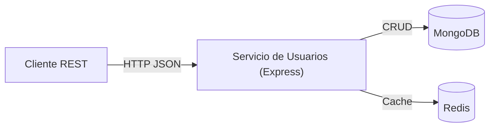
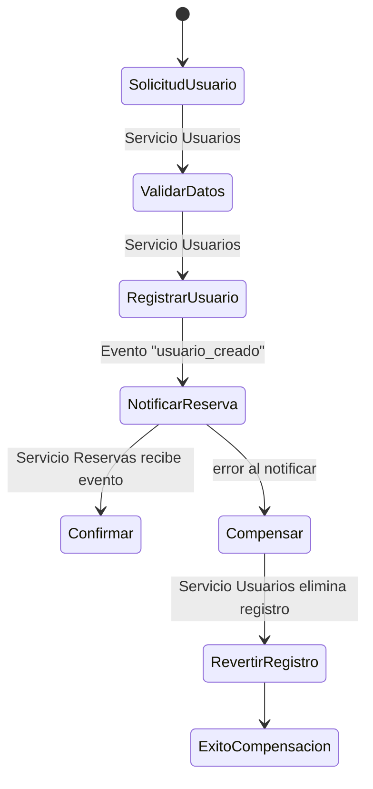
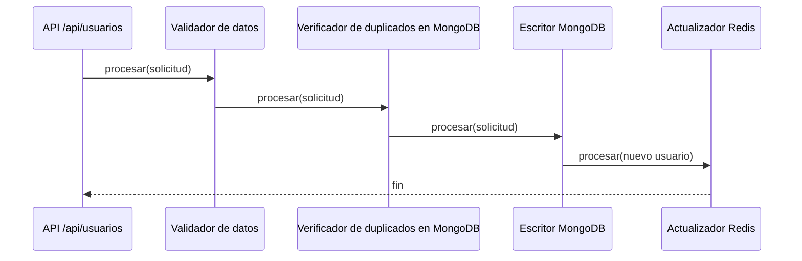

# EventFlow

"EventFlow" es una empresa ficticia que gestiona la venta de entradas y la 
organización de eventos. Para manejar el alto volumen de transacciones y 
consultas, se ha optado por una arquitectura de microservicios. 


## Justificación de Diseño
- **Express y JavaScript:** Los integrantes conociamos las tecnologias, por lo que decidimos concentrarnos en aprender sobre bases NoSQL.
- **Persistencia en MongoDB:** documentos por usuario, ideal para el esquema flexible que necesitamos y fácil de escalar en lecturas.
- **Redis como segunda tecnología NoSQL:** caché de lecturas de usuarios para reducir carga de MongoDB y mejorar tiempos de respuesta.

## Arquitectura


## Flujo SAGA


## Chain of Responsibility



## Ejecución con Docker Compose
Utiliza `docker compose`. El archivo `docker-compose.yml` levanta MongoDB, Redis y el servicio de usuarios.

1. Construir y levantar:
   ```bash
   docker compose up --build
   ```
   Esto expone los mismos puertos (`3001`, `27017`, `6379`) hacia la máquina anfitriona.
2. Verificar status:
   ```bash
   curl http://localhost:3001/health
   ```
3. Detener todo cuando termines:
   ```bash
   docker compose down
   ```

## Endpoints implementados


- `POST /api/usuarios`  
  Crea un usuario. Ejemplo:
  ```json
  {
    "tipo_doc": "DNI",
    "nro_doc": "12345678",
    "nombre": "Carlos",
    "apellido": "Tevez",
    "email": "carlitos@tevez.com",
    "fecha_nac": "1984-02-05"
  }
  ```
- `GET /api/usuarios/{usuario_id}`  
  Recupera el usuario por su identificador. Si el resultado proviene de Redis, la respuesta incluye `"origen": "cache"`.

## Cómo probar los endpoints
### Con Postman
1. Crear una colección nueva.
2. Añadir una petición `POST http://localhost:3001/api/usuarios` con body `raw` → `JSON`.
3. Añadir una petición `GET http://localhost:3001/api/usuarios/{{usuario_id}}`.  
   - Después de ejecutar el POST, copia el valor de `id` y guardalo en una variable de entorno de la colección (`usuario_id`).
4. Ejecuta el GET; si repites la llamada observarás que la segunda respuesta puede contener `origen: "cache"` gracias a Redis.

### Con curl
```bash
curl -X POST http://localhost:3001/api/usuarios \
  -H "Content-Type: application/json" \
  -d '{"tipo_doc":"DNI","nro_doc":"12345678","nombre":"Ada","apellido":"Lovelace","email":"ada@example.com","fecha_nac":"1990-01-05"}'

curl http://localhost:3001/api/usuarios/<ID_DEVUELTO>
```
