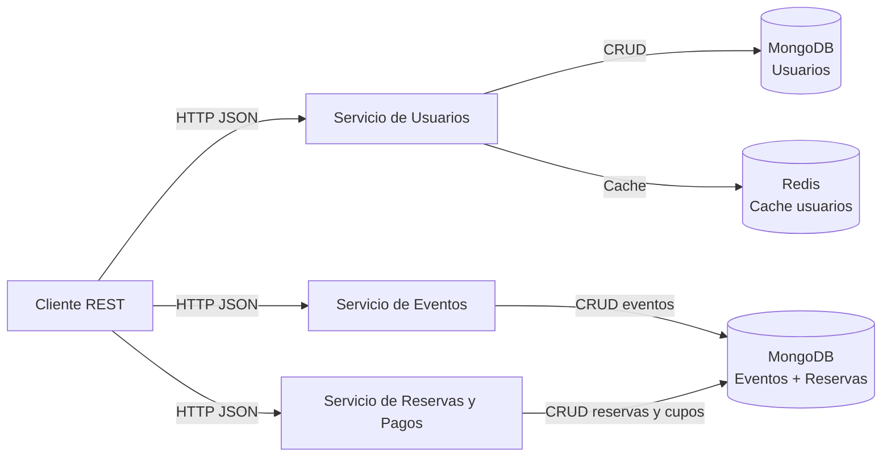
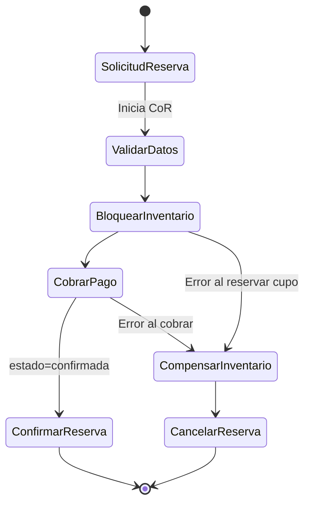
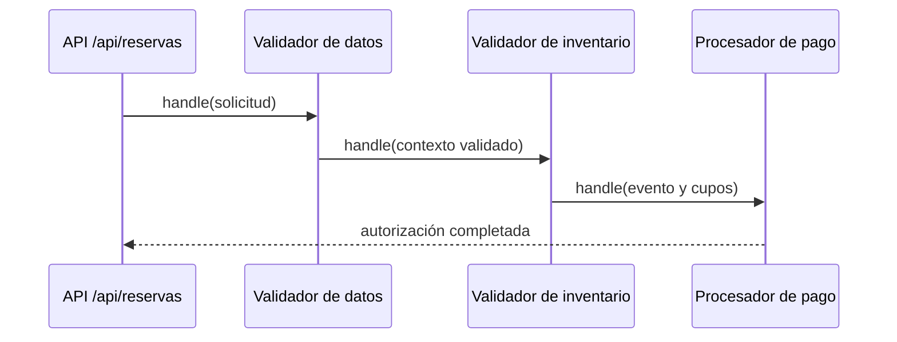

# EventFlow

"EventFlow" es una empresa ficticia que gestiona la venta de entradas y la
organización de eventos. Para manejar el alto volumen de transacciones y
consultas, se ha optado por una arquitectura de microservicios.


## Justificación de Diseño
- **Express y JavaScript:** Los integrantes conociamos las tecnologias, por lo que decidimos concentrarnos en aprender sobre bases NoSQL.
- **Persistencia en MongoDB:** documentos por usuario y por evento, ideal para el esquema flexible que necesitamos y fácil de escalar en lecturas.
- **Redis como segunda tecnología NoSQL:** caché de lecturas de usuarios para reducir carga de MongoDB y mejorar tiempos de respuesta.

## Arquitectura


## Flujo SAGA


**Transacción exitosa:**
1. El cliente invoca `POST /api/reservas` con `usuario_id`, `evento_id`, `cantidad` y `metodo_pago`.
2. La solicitud atraviesa la cadena de validaciones (datos → inventario → procesador de pago).
3. El orquestador SAGA crea la reserva en estado `pendiente`.
4. Se bloquea el inventario restando las entradas solicitadas del `aforo_disponible` del evento.
5. El orquestador procesa el cobro simulado y persiste el resultado.
6. Si todo fue exitoso, la reserva se marca como `confirmada` y se devuelve la información de la reserva, el evento actualizado y el comprobante de pago.

**Compensaciones ante fallos:**
- Si no hay aforo suficiente, el orquestador detiene la SAGA, devuelve un `409` y no se genera reserva confirmada.
- Si el cobro falla después de bloquear cupos, el orquestador libera el inventario (`releaseEventSeats`) y cancela la reserva, anotando el motivo en `notas_compensacion`.
- Cualquier error posterior a la creación de la reserva deja un rastro consistente: cupos liberados y reserva en estado `cancelada`.

## Chain of Responsibility


Las validaciones aplicadas en la cadena son las mínimas necesarias para cumplir el requerimiento:
- **Validador de datos:** asegura que `usuario_id`, `evento_id`, `cantidad` y `metodo_pago` existan, tengan formato correcto y que la cantidad de entradas sea un entero positivo.
- **Validador de inventario:** verifica que el evento exista y que `aforo_disponible` sea suficiente para cubrir la cantidad solicitada antes de iniciar la SAGA.
- **Procesador de pago:** valida que el método de pago esté soportado y que el gateway simulado autorice la operación antes de que el orquestador intente capturar el pago.

## Ejecución con Docker Compose
El archivo `docker-compose.yml` levanta MongoDB, Redis y los tres microservicios (usuarios, eventos y reservas).

1. Construir y levantar:
   ```bash
   docker compose up --build
   ```
   Esto expone los puertos (`3001`, `3002`, `3003`, `27017`, `6379`) hacia la máquina anfitriona.
2. Verificar status:
   ```bash
   curl http://localhost:3001/health
   curl http://localhost:3002/health
   curl http://localhost:3003/health
   ```
3. Detener todo cuando termines:
   ```bash
   docker compose down
   ```


## Endpoints implementados

### Servicio de Usuarios (`http://localhost:3001/api`)
- `POST /usuarios`  
  Crea un usuario. Ejemplo:
  ```json
  {
    "tipo_doc": "DNI",
    "nro_doc": "12345678",
    "nombre": "Carlos",
    "apellido": "Tevez",
    "email": "carlitos@tevez.com",
    "fecha_nac": "1984-02-05"
  }
  ```
- `GET /usuarios/{usuario_id}`  
  Recupera el usuario por su identificador. Si el resultado proviene de Redis, la respuesta incluye `"origen": "cache"`.
- `GET /usuarios/exportar`  
  Devuelve todos los usuarios en formato CSV. El response incluye cabecera `Content-Disposition` para facilitar la descarga (`usuarios.csv`).

### Servicio de Eventos (`http://localhost:3002/api`)
- `POST /eventos`  
  Registra un nuevo evento. Ejemplo:
  ```json
  {
    "nombre": "Festival de Jazz",
    "descripcion": "Edición anual",
    "fecha": "2025-09-15",
    "lugar": "Teatro Central",
    "aforo_total": 5000,
    "aforo_disponible": 4500
  }
```
- `GET /eventos/{evento_id}`  
  Recupera la información de un evento junto con la capacidad disponible.

### Servicio de Reservas y Pagos (`http://localhost:3003/api`)
- `POST /reservas`  
  Inicia la SAGA de orquestación para reservar entradas. Ejemplo de solicitud:
  ```json
  {
    "usuario_id": "66ff20c29ab73e3fbdd3f4a1",
    "evento_id": "66ff20c29ab73e3fbdd3f4d4",
    "cantidad": 2,
    "metodo_pago": "tarjeta"
  }
  ```
  Respuesta en el camino feliz:
  ```json
  {
    "reserva": {
      "id": "67001db2093c4a65c673c2fd",
      "usuario_id": "66ff20c29ab73e3fbdd3f4a1",
      "evento_id": "66ff20c29ab73e3fbdd3f4d4",
      "cantidad": 2,
      "metodo_pago": "tarjeta",
      "estado": "confirmada",
      "total": 2,
      "created_at": "2025-03-04T15:13:54.511Z",
      "updated_at": "2025-03-04T15:13:54.812Z"
    },
    "evento": {
      "id": "66ff20c29ab73e3fbdd3f4d4",
      "nombre": "Festival de Jazz",
      "aforo_disponible": 4498
    },
    "pago": {
      "confirmado": true,
      "monto": 2
    }
  }
  ```
  Si el método de pago es rechazado (por ejemplo, `"metodo_pago":"rechazar"`), la API responde `402` y la reserva queda cancelada con el cupo restablecido.

## Cómo probar los endpoints
### Con Postman
1. Crear una colección nueva.
2. Añadir las peticiones necesarias para los servicios (usuarios `3001`, eventos `3002`, reservas `3003`) con body `raw` -> `JSON` donde aplique.
3. Para `GET /api/usuarios/{usuario_id}` o `GET /api/eventos/{evento_id}`, reutiliza el `id` devuelto por la creación previa.
4. Para probar `POST /api/reservas`, usa `usuario_id` y `evento_id` reales y ajusta `cantidad` y `metodo_pago`.
5. Para descargar el CSV llama a `GET http://localhost:3001/api/usuarios/exportar` y Postman ofrecerá la descarga.

### Con curl
```bash
# Crear un usuario
curl -X POST http://localhost:3001/api/usuarios \
  -H "Content-Type: application/json" \
  -d '{"tipo_doc":"DNI","nro_doc":"22222222","nombre":"Humberto","apellido":"Suazo","email":"ch.suazo@correo.com","fecha_nac":"1981-05-10"}'

# Crear un evento
curl -X POST http://localhost:3002/api/eventos \
  -H "Content-Type: application/json" \
  -d '{"nombre":"Festival de Jazz","descripcion":"Edición anual","fecha":"2025-09-15","lugar":"Teatro Central","aforo_total":5000,"aforo_disponible":4500}'

# Reservar 2 entradas (usar como metodo de pago 'rechazar' para forzar una compensación)
curl -X POST http://localhost:3003/api/reservas \
  -H "Content-Type: application/json" \
  -d '{"usuario_id":"<id_usuario>","evento_id":"<id_evento>","cantidad":2,"metodo_pago":"tarjeta"}'

# Descargar el CSV de usuarios
curl -L http://localhost:3001/api/usuarios/exportar -o usuarios.csv
```
