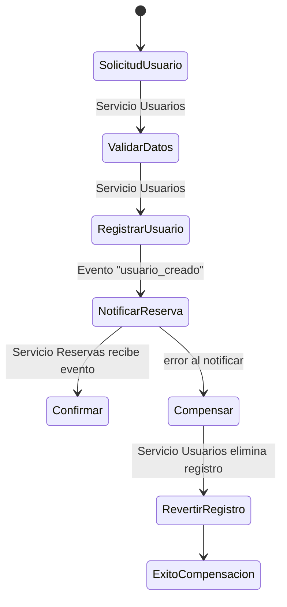
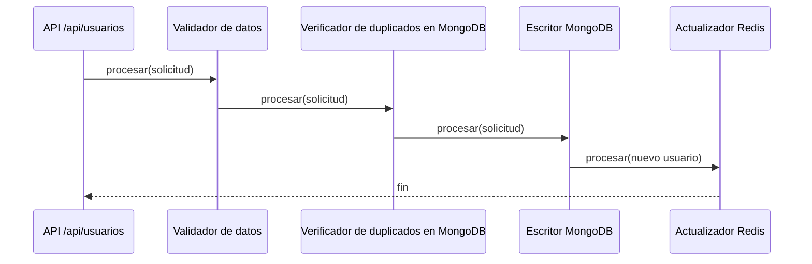

# EventFlow · Servicio de Usuarios


## Justificación de Diseño
- **Express y JavaScript:** Los integrantes conociamos las tecnologias, por lo que decidimos concentrarnos en aprender sobre bases NoSQL.
- **Persistencia en MongoDB:** documentos por usuario, ideal para el esquema flexible que necesitamos y fácil de escalar en lecturas.
- **Redis como segunda tecnología NoSQL:** caché de lecturas de usuarios para reducir carga de MongoDB y demostrar la combinación de bases de datos.
- **Validación ligera en el controlador:** solo verificamos campos obligatorios y formatos básicos.

## Arquitectura Actual
```mermaid
flowchart LR
  Client[Cliente REST] -->|HTTP JSON| UsersService[Servicio de Usuarios (Express)]
  UsersService -->|CRUD| MongoDB[(MongoDB)]
  UsersService -->|Caché| Redis[(Redis)]
```

## Flujo SAGA Planeado


## Chain of Responsibility Planeado


## Estructura de Carpetas
```
src/
  users_service/
    cache/
      userCache.js
    db/
      mongo.js
      redis.js
    models/
      userModel.js
    repositories/
      userRepository.js
    config.js
    routes.js
    server.js
docs/
  Tarea2-NoSQL-2025-Buceo.pdf
package.json
.env.example
.gitignore
```

## Configuración y ejecución
1. **Instalar dependencias**
   ```bash
   npm install
   ```
2. **Configurar variables de entorno**  
   Copia `.env.example` a `.env` y ajusta valores si lo necesitas:
   - `PORT`: puerto donde escuchará Express (3001 por defecto).
   - `MONGODB_URI`: cadena de conexión a MongoDB.
   - `REDIS_URL`: URL de Redis.
3. **Arrancar MongoDB y Redis**  
   Puedes usar instancias locales o contenedores rápidos:
   ```bash
   docker run -d --name eventflow-mongo -p 27017:27017 mongo:6
   docker run -d --name eventflow-redis -p 6379:6379 redis:7
   ```
4. **Levantar el servicio**
   ```bash
   npm start
   ```
5. **Verificar estado**
   ```bash
   curl http://localhost:3001/health
   ```

## Ejecución con Docker Compose
Si prefieres que las dependencias se levanten juntas, utiliza `docker compose`. El archivo `docker-compose.yml` levanta MongoDB, Redis y el servicio de usuarios.

1. Construir y levantar:
   ```bash
   docker compose up --build
   ```
   Esto expone los mismos puertos (`3001`, `27017`, `6379`) hacia la máquina anfitriona.
2. Verificar salud:
   ```bash
   curl http://localhost:3001/health
   ```
3. Detener todo cuando termines:
   ```bash
   docker compose down
   ```

## Endpoints implementados
Solo se desarrollaron los endpoints obligatorios del servicio de usuarios.

- `POST /api/usuarios`  
  Crea un usuario con estos atributos obligatorios:
  ```json
  {
    "tipo_doc": "DNI",
    "nro_doc": "12345678",
    "nombre": "Ada",
    "apellido": "Lovelace",
    "email": "ada@example.com",
    "fecha_nac": "1990-01-05"
  }
  ```
- `GET /api/usuarios/{usuario_id}`  
  Recupera el usuario por su identificador. Si el resultado proviene de Redis, la respuesta incluye `"origen": "cache"`.

## Cómo probar los endpoints
### Con Postman
1. Crear una colección nueva llamada `EventFlow Usuarios`.
2. Añadir una petición `POST http://localhost:3001/api/usuarios` con body `raw` → `JSON` y el payload del ejemplo anterior.
3. Añadir una petición `GET http://localhost:3001/api/usuarios/{{usuario_id}}`.  
   - Después de ejecutar el POST, copia el valor de `id` y guárdalo en una variable de entorno de la colección (`usuario_id`).
4. Ejecuta el GET; si repites la llamada observarás que la segunda respuesta puede contener `origen: "cache"` gracias a Redis.

### Con curl
```bash
curl -X POST http://localhost:3001/api/usuarios \
  -H "Content-Type: application/json" \
  -d '{"tipo_doc":"DNI","nro_doc":"12345678","nombre":"Ada","apellido":"Lovelace","email":"ada@example.com","fecha_nac":"1990-01-05"}'

curl http://localhost:3001/api/usuarios/<ID_DEVUELTO>
```

> Próximos pasos: cuando incorporemos los servicios de eventos y reservas conectaremos la SAGA completa, el patrón Chain of Responsibility dentro del proceso de reservas y el orquestador que utilizará estos mismos componentes.
