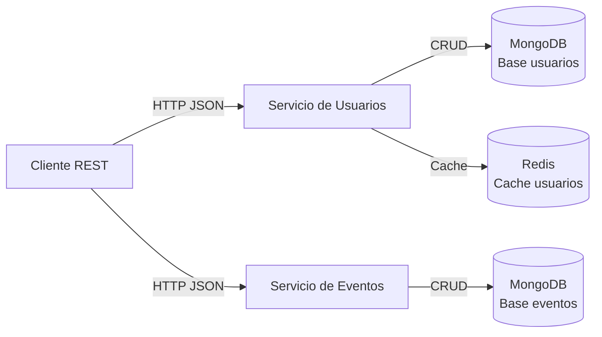
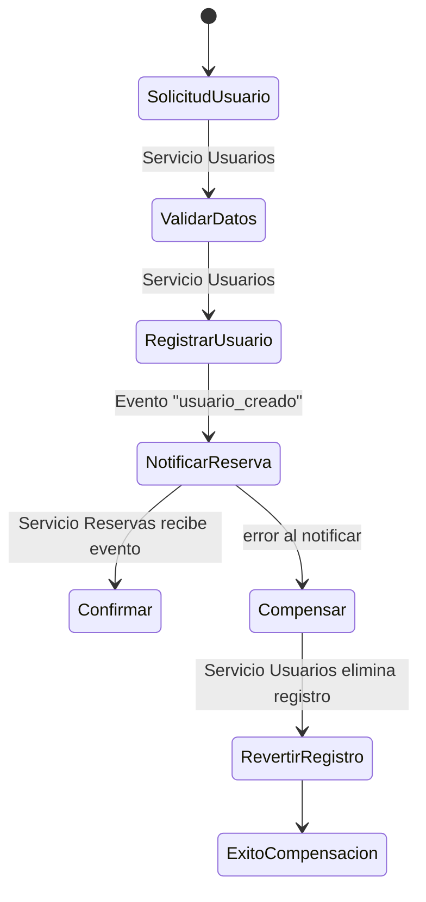
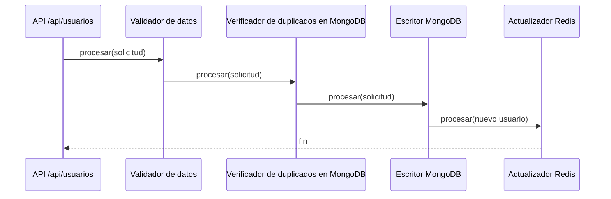
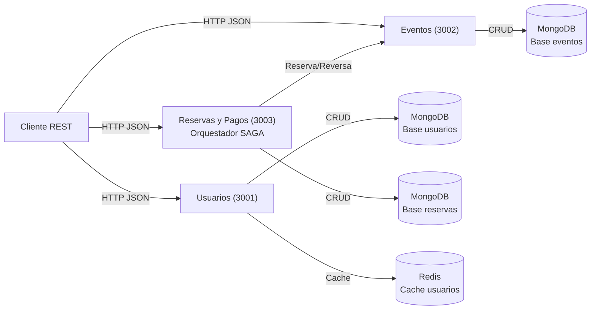
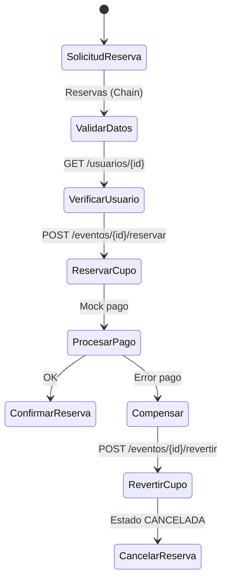
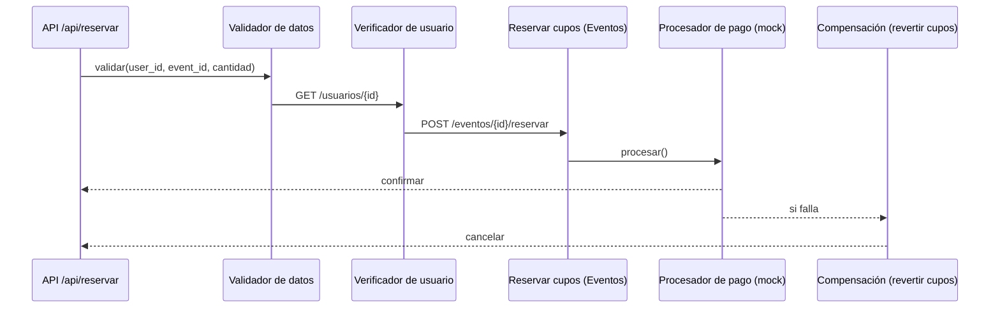

# EventFlow

"EventFlow" es una empresa ficticia que gestiona la venta de entradas y la
organización de eventos. Para manejar el alto volumen de transacciones y
consultas, se ha optado por una arquitectura de microservicios.


## Justificación de Diseño
- **Express y JavaScript:** Los integrantes conociamos las tecnologias, por lo que decidimos concentrarnos en aprender sobre bases NoSQL.
- **Persistencia en MongoDB:** documentos por usuario y por evento, ideal para el esquema flexible que necesitamos y fácil de escalar en lecturas.
- **Redis como segunda tecnología NoSQL:** caché de lecturas de usuarios para reducir carga de MongoDB y mejorar tiempos de respuesta.

## Arquitectura


## Flujo SAGA


## Chain of Responsibility



## Ejecución con Docker Compose
El archivo `docker-compose.yml` levanta MongoDB, Redis y los servicios de usuarios y eventos.

1. Construir y levantar:
   ```bash
   docker compose up --build
   ```
   Esto expone los puertos (`3001`, `3002`, `27017`, `6379`) hacia la maquina anfitriona.
2. Verificar status:
   ```bash
   curl http://localhost:3001/health
   curl http://localhost:3002/health
   ```
3. Detener todo cuando termines:
   ```bash
   docker compose down
   ```


## Endpoints implementados

### Servicio de Usuarios (`http://localhost:3001/api`)
- `POST /usuarios`  
  Crea un usuario. Ejemplo:
  ```json
  {
    "tipo_doc": "DNI",
    "nro_doc": "12345678",
    "nombre": "Carlos",
    "apellido": "Tevez",
    "email": "carlitos@tevez.com",
    "fecha_nac": "1984-02-05"
  }
  ```
- `GET /usuarios/{usuario_id}`  
  Recupera el usuario por su identificador. Si el resultado proviene de Redis, la respuesta incluye `"origen": "cache"`.
- `GET /usuarios/exportar`  
  Devuelve todos los usuarios en formato CSV. El response incluye cabecera `Content-Disposition` para facilitar la descarga (`usuarios.csv`).

### Servicio de Eventos (`http://localhost:3002/api`)
- `POST /eventos`  
  Registra un nuevo evento. Ejemplo:
  ```json
  {
    "nombre": "Festival de Jazz",
    "descripcion": "Edición anual",
    "fecha": "2025-09-15",
    "lugar": "Teatro Central",
    "aforo_total": 5000,
    "aforo_disponible": 4500
  }
  ```
- `GET /eventos/{evento_id}`  
  Recupera la información de un evento junto con la capacidad disponible.
 - `POST /eventos/{evento_id}/reservar`  
   Reserva cupos de forma atómica. Body: `{ "cantidad": 2 }`.
 - `POST /eventos/{evento_id}/revertir`  
   Revierte cupos (compensación SAGA). Body: `{ "cantidad": 2 }`.

### Servicio de Reservas y Pagos (`http://localhost:3003/api`)
- `POST /reservar`  
  Inicia la SAGA con Chain of Responsibility. Body:
  ```json
  {
    "user_id": "<ObjectId usuario>",
    "event_id": "<ObjectId evento>",
    "cantidad": 2
  }
  ```
  Flujo: valida datos → verifica usuario → intenta reservar cupo (servicio Eventos) → procesa pago (mock) → confirma o compensa.

## Cómo probar los endpoints
### Con Postman
1. Crear una colección nueva.
2. Añadir las peticiones necesarias para los servicios (usuarios en el puerto `3001`, eventos en `3002`) con body `raw` → `JSON` donde aplique.
3. Para `GET /api/usuarios/{usuario_id}` o `GET /api/eventos/{evento_id}`, reutiliza el `id` devuelto por la creación previa.
4. Para descargar el CSV llama a `GET http://localhost:3001/api/usuarios/exportar` y Postman ofrecerá la descarga.

### Con curl
```bash
# Crear un usuario
curl -X POST http://localhost:3001/api/usuarios \
  -H "Content-Type: application/json" \
  -d '{"tipo_doc":"DNI","nro_doc":"22222222","nombre":"Humberto","apellido":"Suazo","email":"ch.suazo@correo.com","fecha_nac":"1981-05-10"}'

# Crear un evento
curl -X POST http://localhost:3002/api/eventos \
  -H "Content-Type: application/json" \
  -d '{"nombre":"Festival de Jazz","descripcion":"Edición anual","fecha":"2025-09-15","lugar":"Teatro Central","aforo_total":5000,"aforo_disponible":4500}'

# Descargar el CSV de usuarios
curl -L http://localhost:3001/api/usuarios/exportar -o usuarios.csv

# Realizar una reserva (SAGA)
curl -X POST http://localhost:3003/api/reservar \
  -H "Content-Type: application/json" \
  -d '{"user_id":"<ID_USUARIO>","event_id":"<ID_EVENTO>","cantidad":2}'
```

## Arquitectura (Actualizada)


## SAGA: Reserva de Entradas


## Chain of Responsibility (Reservas)


## Servicios y Puertos
- Usuarios: `http://localhost:3001` (MongoDB usuarios, Redis cache)
- Eventos: `http://localhost:3002` (MongoDB eventos)
- Reservas: `http://localhost:3003` (MongoDB reservas)
- Infra: MongoDB `27017`, Redis `6379`

## Ejecución con Docker Compose
1. Construir y levantar:
   - `docker compose up --build`
2. Health checks:
   - `curl http://localhost:3001/health`
   - `curl http://localhost:3002/health`
   - `curl http://localhost:3003/health`
3. Detener:
   - `docker compose down`

## Variables de Entorno
- `MONGODB_URI`: conexión para Usuarios (por defecto `mongodb://localhost:27017/eventflow_users_service`).
- `EVENTS_MONGODB_URI`: conexión para Eventos (por defecto `mongodb://localhost:27017/eventflow_events_service`).
- `RESERVATIONS_MONGODB_URI`: conexión para Reservas (por defecto `mongodb://localhost:27017/eventflow_reservations_service`).
- `REDIS_URL`: URL de Redis para cache de Usuarios (por defecto `redis://localhost:6379`).
- `USERS_BASE_URL`: base URL del servicio de Usuarios para el orquestador (por defecto `http://localhost:3001`).
- `EVENTS_BASE_URL`: base URL del servicio de Eventos para el orquestador (por defecto `http://localhost:3002`).

Sugerido: copiar `.env.example` a `.env` y ajustar valores.

## Ejecución local (sin Docker)
Requiere MongoDB y Redis locales.
- Instalar dependencias: `npm install`
- Usuarios: `PORT=3001 MONGODB_URI=mongodb://localhost:27017/eventflow_users_service REDIS_URL=redis://localhost:6379 npm run start:users`
- Eventos: `PORT=3002 EVENTS_MONGODB_URI=mongodb://localhost:27017/eventflow_events_service npm run start:events`
- Reservas: `PORT=3003 RESERVATIONS_MONGODB_URI=mongodb://localhost:27017/eventflow_reservations_service USERS_BASE_URL=http://localhost:3001 EVENTS_BASE_URL=http://localhost:3002 npm run start:reservations`

## Modelos de Datos
- Usuario: `tipo_doc`, `nro_doc` (índice único), `nombre`, `apellido`, `email` (normalizado), `fecha_nac`, `created_at`, `updated_at`.
- Evento: `nombre`, `descripcion`, `fecha`, `lugar`, `aforo_total` (>=0), `aforo_disponible` (>=0 y <= `aforo_total`).
- Reserva: `user_id`, `event_id`, `cantidad` (>=1), `estado` (`CREADA|CONFIRMADA|CANCELADA`), `pago_ref`, `created_at`, `updated_at`.

## Garantías de Concurrencia (Reservas)
- Reserva de cupos atómica via `findOneAndUpdate({ _id, aforo_disponible: { $gte: cantidad } }, { $inc: { aforo_disponible: -cantidad } })`.
- Compensación SAGA ante fallo de pago: `revertir` (incremento de cupos) y estado `CANCELADA`.

## Exportación de Datos
- `GET /api/usuarios/exportar` retorna CSV de usuarios.
- Anonimización opcional: `GET /api/usuarios/exportar?anon=1`
  - Campos anonimizados irreversiblemente (SHA-256 con sal `ANON_SALT`): `id`, `nro_doc`, `email`, `nombre`, `apellido`.
  - `fecha_nac` se reduce a año (primer día del año) para proteger granularidad.
  - El archivo se descarga como `usuarios_anon.csv`.
  - Configurar `.env` con `ANON_SALT`.
  - Nota: versión por streaming con cursor queda como mejora para grandes volúmenes.

## Roadmap / Próximos pasos
- Anonimización en exportación (`/usuarios/exportar?anon=1`) y/o streaming con cursor.
- Tests (Jest + supertest) para CRUD, cache, reservas (feliz/compensación).
- Lint/format (ESLint + Prettier) y scripts `npm run lint` / `npm run test`.
- Logs estructurados, request-id y métricas básicas.
- Documentar errores (códigos y formatos) y colección Postman.
