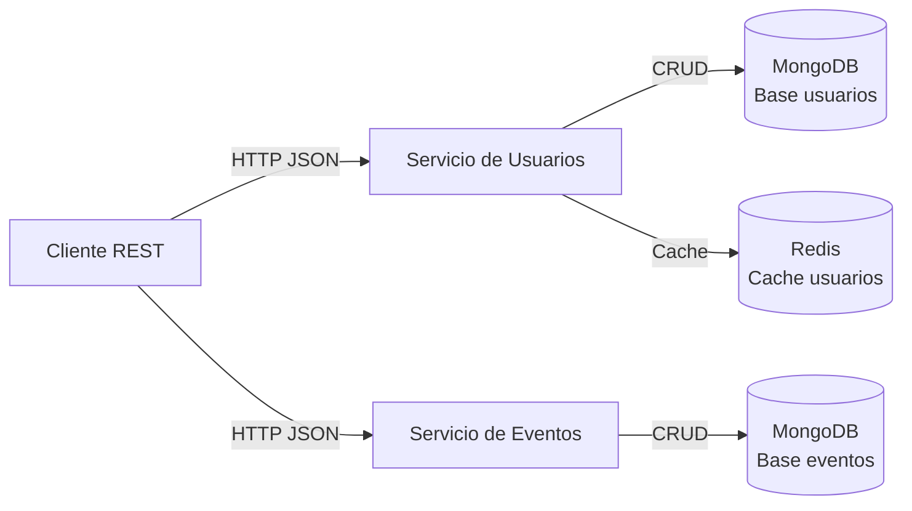
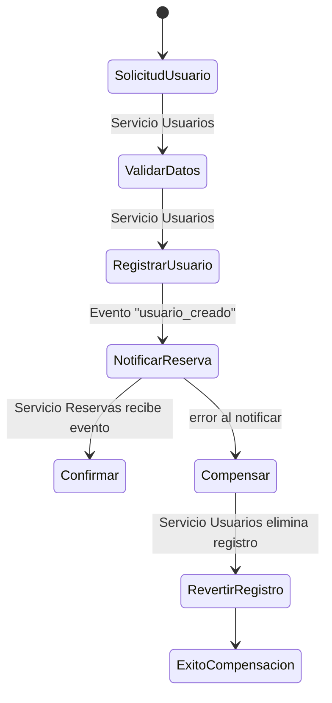
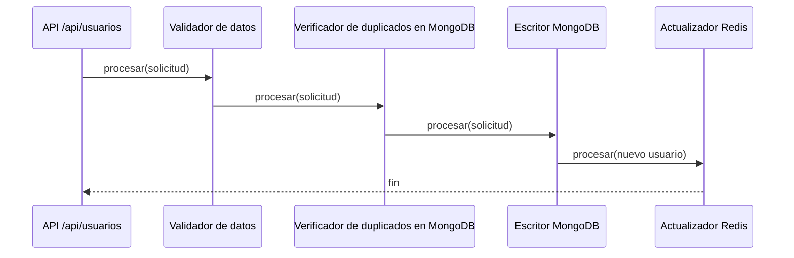

# EventFlow

"EventFlow" es una empresa ficticia que gestiona la venta de entradas y la
organización de eventos. Para manejar el alto volumen de transacciones y
consultas, se ha optado por una arquitectura de microservicios.


## Justificación de Diseño
- **Express y JavaScript:** Los integrantes conociamos las tecnologias, por lo que decidimos concentrarnos en aprender sobre bases NoSQL.
- **Persistencia en MongoDB:** documentos por usuario y por evento, ideal para el esquema flexible que necesitamos y fácil de escalar en lecturas.
- **Redis como segunda tecnología NoSQL:** caché de lecturas de usuarios para reducir carga de MongoDB y mejorar tiempos de respuesta.

## Arquitectura


## Flujo SAGA


## Chain of Responsibility



## Ejecución con Docker Compose
El archivo `docker-compose.yml` levanta MongoDB, Redis y los servicios de usuarios y eventos.

1. Construir y levantar:
   ```bash
   docker compose up --build
   ```
   Esto expone los puertos (`3001`, `3002`, `27017`, `6379`) hacia la maquina anfitriona.
2. Verificar status:
   ```bash
   curl http://localhost:3001/health
   curl http://localhost:3002/health
   ```
3. Detener todo cuando termines:
   ```bash
   docker compose down
   ```


## Endpoints implementados

### Servicio de Usuarios (`http://localhost:3001/api`)
- `POST /usuarios`  
  Crea un usuario. Ejemplo:
  ```json
  {
    "tipo_doc": "DNI",
    "nro_doc": "12345678",
    "nombre": "Carlos",
    "apellido": "Tevez",
    "email": "carlitos@tevez.com",
    "fecha_nac": "1984-02-05"
  }
  ```
- `GET /usuarios/{usuario_id}`  
  Recupera el usuario por su identificador. Si el resultado proviene de Redis, la respuesta incluye `"origen": "cache"`.
- `GET /usuarios/exportar`  
  Devuelve todos los usuarios en formato CSV. El response incluye cabecera `Content-Disposition` para facilitar la descarga (`usuarios.csv`).

### Servicio de Eventos (`http://localhost:3002/api`)
- `POST /eventos`  
  Registra un nuevo evento. Ejemplo:
  ```json
  {
    "nombre": "Festival de Jazz",
    "descripcion": "Edición anual",
    "fecha": "2025-09-15",
    "lugar": "Teatro Central",
    "aforo_total": 5000,
    "aforo_disponible": 4500
  }
  ```
- `GET /eventos/{evento_id}`  
  Recupera la información de un evento junto con la capacidad disponible.

## Cómo probar los endpoints
### Con Postman
1. Crear una colección nueva.
2. Añadir las peticiones necesarias para los servicios (usuarios en el puerto `3001`, eventos en `3002`) con body `raw` → `JSON` donde aplique.
3. Para `GET /api/usuarios/{usuario_id}` o `GET /api/eventos/{evento_id}`, reutiliza el `id` devuelto por la creación previa.
4. Para descargar el CSV llama a `GET http://localhost:3001/api/usuarios/exportar` y Postman ofrecerá la descarga.

### Con curl
```bash
# Crear un usuario
curl -X POST http://localhost:3001/api/usuarios \
  -H "Content-Type: application/json" \
  -d '{"tipo_doc":"DNI","nro_doc":"22222222","nombre":"Humberto","apellido":"Suazo","email":"ch.suazo@correo.com","fecha_nac":"1981-05-10"}'

# Crear un evento
curl -X POST http://localhost:3002/api/eventos \
  -H "Content-Type: application/json" \
  -d '{"nombre":"Festival de Jazz","descripcion":"Edición anual","fecha":"2025-09-15","lugar":"Teatro Central","aforo_total":5000,"aforo_disponible":4500}'

# Descargar el CSV de usuarios
curl -L http://localhost:3001/api/usuarios/exportar -o usuarios.csv
```
